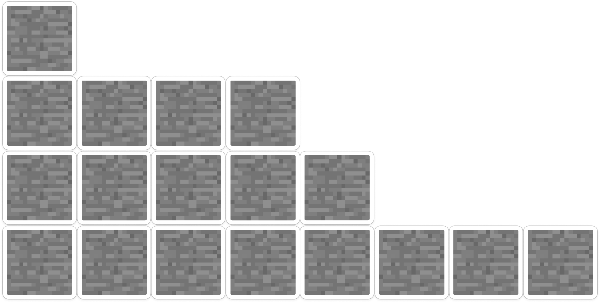

# Задание **1.A** - Приветсвие пользователя

### **Условие:**

Необходимо написать функцию greetings, которая принимает на вход строчку, состоящую из фамилии и имени пользователя, и возвращает приветствие в формате строки:

```
greetings("Гендо Геннадий")
>>> Доброго времени суток, Гендо "Человек" Геннадий!
```

> Пояснение к примеру: необходимо вернуть из функции строку формата `Доброго времени суток, ИМЯ "Человек" ФАМИЛИЯ!`

<br>

# Задание **1.B** - Сумма на отрезке

### **Условие:**

Реализуйте функцию `summation(start, end)`, которая суммирает все целые числа на отрезке [`start`, `end`], если `end` < `start`, поменяйте их местами.

### **Входные данные**

Даны числа `start` и `end`.

#### **Выходные данные**

Необходимо вывести число cумму чисел на отрезке

#### Пример 1

Входные данные

```
2 12
```

Выходные данные

```
77
```

#### Пример 2

Входные данные

```
-4 4
```

Выходные данные

```
0
```

#### Пример 3

Входные данные

```
3 2
```

Выходные данные

```
5
```

<br>

# Задание **1.C** - Усовершенствованный сумматор

### **Условие:**

Необходимо написать функцию `summation`, на вход которой подаётся некоторое количество целых чисел, которая будет считать сумму всех введённых чисел с условием, что:

1. Если число отрицательное, то надо сделать его положительным и умножить на два;
2. Каждое число нужно нормализовать (поделить каждое число на самое большое число после преобразования №1)

#### Пример

```python
summation(-10, 2, 3, 15, -4)
>>> 2.4
```

<br>

# Задание **2.A** - Лесенка

### **Условие:**

Лесенкой называется набор блоков, в котором каждый следующий уровень содержит меньше блоков, чем в предыдущий. Напишите программу, вычисляющую кол-во уровней.



### **Входные данные**

Дано натуральное число _n_ (1 <= n <= 100) - кол-во блоков в лесенке

### **Выходные данные**

Необходимо вывести число cумму чисел на отрезке

### Пример 1

Входные данные

```
3
```

Выходные данные

```
2
```

### Пример 2

Входные данные

```
6
```

Выходные данные

```
3
```

<br>

# Задание **2.B** - Сравнение словарей

### **Условие:**

Реализуйте функцию `key_difference(dict1, dict2)`, которая сравнивает словари

- `added` , если ключа не было в первом словаре, но он появился во втором словаре.
- `deleted`, если ключ был в первом словаре, но его не было во втором.
- `changed`, если ключ присутствует в обоих словарях, но значения различаются;
- `equal`, если ключ присутствует в обоих словарях, и значения совпадают

### **Примечание**

Ключи и значения словарей представлены **только** в строковом типе данных. Ключи в возвращаемой функцией словаре должно распологаться в следующем порядке: сначала все ключи первого словаря, затем второго.

### **Входные данные**

Для проверки данной задачи рекомендуется создать два глобальных словаря dict1 и dict2. В примерах будут указаны строчки, которые можно просто вставить в программу и вызвать функцию с `dict1` и `dict2`

### **Выходные данные**

Необходимо вернуть словарь формата `{"ключ": "статус"}`

### Пример 1

Входные данные

```
dict1 = {"a":"b", "b":"a"}
dict2 = {"a":"b", "b":"a", "c": "a"}
```

Выходные данные

```
{'a': 'equal', 'b': 'equal', 'c': 'added'}
```

### Пример 2

Входные данные

```
dict1 = {"a":"b", "b":"a",  "c": "a"}
dict2 = {"a":"b", "b":"a"}
```

Выходные данные

```
{'a': 'equal', 'b': 'equal', 'c': 'deleted'}
```

# Задание **2.С** - Перевод в **n** систему счисления.

### **Условие:**

Дано число в 10-ой системе счисления, реализуйте функцию, которая на вход принимает два параметра, число `value` и новая систему счисления - `base`.

### **Входные данные**

Дано число _N_ в 10 сс, и новое основение сс 2<=_K_<=36 (если основание сс больше 10 для обозначения использовать заглавные латинские буквы, аналогично 16 сс. 10 - **A**, 11 - **B** , и т.д.).

#### **Выходные данные**

Необходимо вывести число в новой системе счисления.

### Замечание

Нельзя использовать встроенные методы `bin()`, `hex()` и т.п. а также `int(\<value>, \<base>)` и форматирование `"{0:b}".format(int(n))`

Входные данные

```
2 2
```

Выходные данные

```
10
```

Входные данные

```
10 16
```

Выходные данные

```
A
```

Входные данные

```
35 36
```

Выходные данные

```
Z
```

<br>
